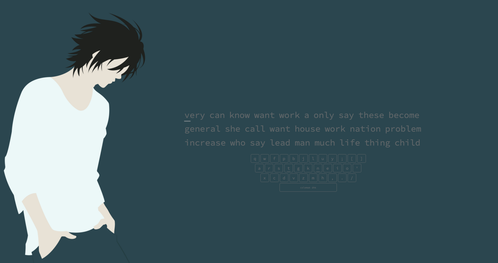
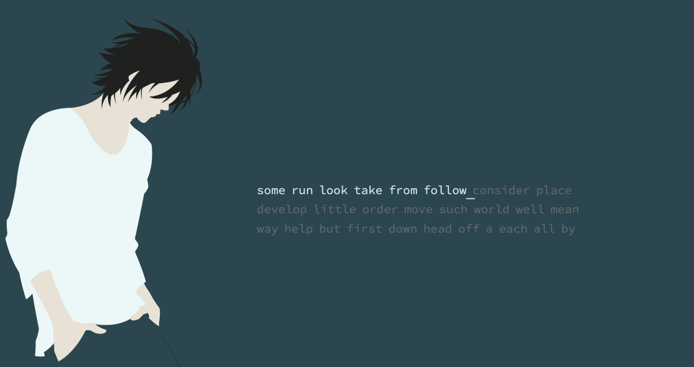

# L Minimal Theme

This theme removes all the text and buttons on the top and bottom of the page (ie. logo, typing button, settings button, paypal link) meaning you should be comfortable with navigating through MonkeyType using its built-in command line.

I'd like to eventually just add the text theme to the CSS text but you can use this link to get it for now:

https://monkeytype.com?customTheme=%23214b5e%2C%2395b1c1%2C%23bbb9b9%2C%235e6568%2C%23ccd8e0%2C%231f211e%2C%231f211e%2C%231f211e%2C%231f211e

If you would prefer to keep all the GUI elements, no worries! Simply comment out the #top and/or #bottom IDs and everything will appear again.

Depending on your monitor and window size, you may need to play around with the **background-size**, **background-position**, and **right** variables. You could also try changing the width in MonkeyType's preferences page.

